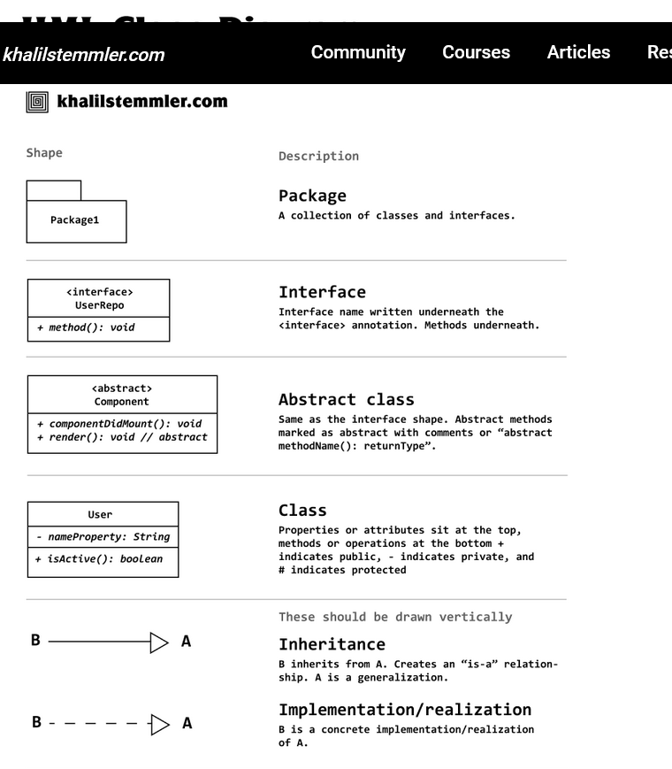
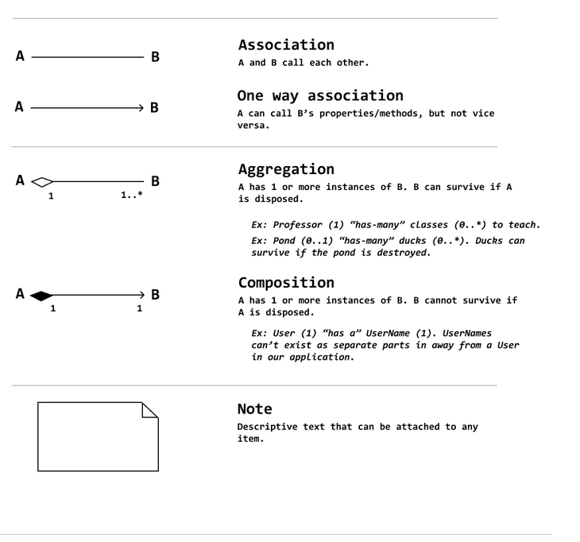
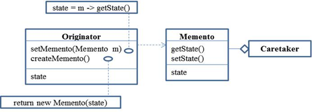
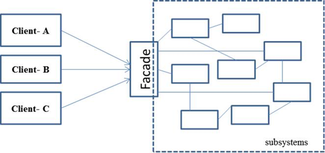

## Web References from Lessons


---
### o'Reilly
[All lessons playlist - oreilly](https://learning.oreilly.com/playlists/8cd4e56f-1980-4a1f-a054-5f3d8d3fc77c/)


---
## lesson 1 - Libraries

#### A. OOP
1. [OOP - w3schools](https://www.w3schools.com/cpp/cpp_oop.asp)
2. [OOP Beginners guide](https://dev.to/charanrajgolla/beginners-guide---object-oriented-programming)
3. [Intro to OOP - geeks](https://www.geeksforgeeks.org/introduction-of-object-oriented-programming/)
2. [UML class diagrams](https://www.visual-paradigm.com/guide/uml-unified-modeling-language/uml-class-diagram-tutorial/)




ref: https://khalilstemmler.com/articles/uml-cheatsheet/

3. [COS3711 - addtional resources](https://mymodules.dtls.unisa.ac.za/mod/folder/view.php?id=533468)

#### B. Libraries and Frameworks
1. [lib vs framework - medium](https://medium.com/@i.e.rahul/eli5-platform-vs-framework-vs-library-154539de8b)
2. [lib vs framework - stackoverflow](https://stackoverflow.com/questions/48239046/difference-between-library-platform-and-framework)
3. [lib vs framework - k&c](https://kruschecompany.com/framework-vs-library/)
4. [lib vs framework - codecamp](https://www.freecodecamp.org/news/the-difference-between-a-framework-and-a-library-bd133054023f/)
5. [lib vs framework - interviewbit](https://www.interviewbit.com/blog/framework-vs-library/)

#### C. Design Patterns

2. [UML and patterns- Tuks pdf](https://www.cs.up.ac.za/cs/lmarshall/TDP/Notes/_Chapter1_IntroDesignPatterns_and_UML.pdf)
3. [O'Reilly – Head First Design Patterns: Chapter 1. Welcome to Design Patterns: Intro to Design Patterns](https://learning.oreilly.com/playlists/8cd4e56f-1980-4a1f-a054-5f3d8d3fc77c)
4. [O'Reilly – Gang of Four: Chapter 1. Introduction - direct link](https://learning.oreilly.com/library/view/design-patterns-elements/0201633612/ch01.html)


#### D. Anti-Patterns
1. [wikipedia](https://en.wikipedia.org/wiki/Anti-pattern)
1. [sourecemaking](https://sourcemaking.com/antipatterns)
2. [develpreneur](https://develpreneur.com/general-anti-pattern-definition-new-season-kick-off/)
3. [geeksforgeeks](https://www.geeksforgeeks.org/6-types-of-anti-patterns-to-avoid-in-software-development/)

#### E. Serializer patterns


1. [flylib - serializer pattern](https://flylib.com/books/en/2.385.1/serializer_pattern.html)

---

## Lesson 2 - Meta-Objects, Properties, and Reflective Programming

#### A. QT Object System

[QObject and MOC -vid](https://www.youtube.com/watch?v=KugPAznC4Yo)📺  
[Episode 5 - QObjects can not be copied: - vid ](https://youtu.be/M6W-ViiX0l0?si=2REqNhLnBW_GJoGS)📺  
[Qt 6 - Episode 6 - Parent child relationships: - vid ](https://youtu.be/oVOgoT9TaTg?si=f7iYrEvNWz_Q4IjW)📺   


[The Meta-Object System](https://doc.qt.io/qt-6/metaobjects.html)  
[The Property System ](https://doc.qt.io/qt-6/properties.html)  
[Object Model ](https://doc.qt.io/qt-6/object.html)  
[Object Trees and Ownership ](https://doc.qt.io/qt-6/objecttrees.html)  
[Signals and Slots ](https://doc.qt.io/qt-6/signalsandslots.html)  


[QObject ](https://doc.qt.io/qt-6/qobject.html) When reading about the QObject class, note when to use metaobject() and when to use staticMetaObject().  
[QMetaObject](https://doc.qt.io/qt-6/qmetaobject.html)  
[QMetaProperty](https://doc.qt.io/qt-6/qmetaproperty.html)  
[QVariant](https://doc.qt.io/qt-6/qvariant.html)  
[QMetaType](https://doc.qt.io/qt-6/qmetatype.html)  


#### B. Using QVariant, QMetaType, and Q_ENUM

[VoidRealms Qt 88 - User Feedback QVariant - vid](https://youtu.be/iD5R3-z3u78)📺  
[C++ QT 109 - Q_ENUM and how to switch on a string - vid](https://youtu.be/Fr6BDQD68ZE?si=WK2k7-myCjKWzHe-)📺  

### C. Static variables

[static-data-members](https://www.tutorialspoint.com/static-data-members-in-cplusplus)  
[cpp_static_members](https://www.tutorialspoint.com/cplusplus/cpp_static_members.htm)  

### D. Signals and Slots

[New_Signal_Slot_Synta](https://wiki.qt.io/New_Signal_Slot_Syntax)  
[signalsandslots-syntaxe](https://doc.qt.io/qt-5/signalsandslots-syntaxes.html)  
[new-signals-slots-syntax-in-qt5](https://woboq.com/blog/new-signals-slots-syntax-in-qt5.html)  

### E. Q_ENUM

The Q_ENUMS macro is deprecated, use below...
[Q_ENUM macro](https://doc.qt.io/qt-6/qobject.html#Q_ENUM)

---

## lesson 3 - Models and Views

#### Qt model/view programming
1. [id1573371497 - Qt model/view programming](https://apps.apple.com/za/app/unisa-mymodules/id1573371497) 📖
2. [watch - Qt model/view programming](https://www.youtube.com/watch?v=EJf-vZ6FQfc&list=PL2D1942A4688E9D63&index=50&ab_channel=VoidRealms) 📺
3. [Design_Patterns#Model-View-Controller_(MVC) - Qt model/view programming](https://en.wikibooks.org/wiki/C++_Programming/Code/Design_Patterns#Model-View-Controller_(MVC)) 📖
4. [watch - Qt model/view programming](https://www.youtube.com/watch?v=M0PZDrDwdHM&list=PL2D1942A4688E9D63&index=50&ab_channel=VoidRealms) 📺
5. [watch - Qt model/view programming](https://www.youtube.com/watch?v=uDC9L4T59bM&list=PL2D1942A4688E9D63&index=48&ab_channel=VoidRealms) 📺
6. [watch - Qt model/view programming](https://www.youtube.com/watch?v=92biLZST6Vg&list=PL2D1942A4688E9D63&index=50&ab_channel=VoidRealms) 📺

#### Smart pointers
1. [qsharedpointer.html - Smart pointers](https://doc.qt.io/qt-6/qsharedpointer.html) 📖
2. [qscopedpointer.html - Smart pointers](https://doc.qt.io/qt-6/qscopedpointer.html) 📖

---


### lesson 4 - Regex and Validation

#### Input masks, validators, and subclassing QValidator
1. [qlineedit.html#inputMask-prop - 📖](https://doc.qt.io/qt-6/qlineedit.html#inputMask-prop)
2. [qregularexpressionvalidator.html - 📖](https://doc.qt.io/qt-6/qregularexpressionvalidator.html)
3. [qintvalidator.html - 📖](https://doc.qt.io/qt-6/qintvalidator.html)
4. [watch - 📺](https://www.youtube.com/watch?v=tgFAcsCu7Es&ab_channel=ProgenitorSoftworks)
5. [qdoublevalidator.html - 📖](https://doc.qt.io/qt-6/qdoublevalidator.html)
6. [qvalidator.html - 📖](https://doc.qt.io/qt-6/qvalidator.html)

#### Regular expressions
1. [quickstart.html - 📖](https://www.regular-expressions.info/quickstart.html)

---

## lesson 5 - XML

#### What is XML?
1. [default.asp - 📖](https://www.w3schools.com/xml/default.asp)
2. [xml_whatis.asp - 📖](https://www.w3schools.com/xml/xml_whatis.asp)
3. [xml_dom.asp - 📖](https://www.w3schools.com/xml/xml_dom.asp)
4. [watch - 📺](https://www.youtube.com/watch?v=NXGE5XUrRSI&ab_channel=VoidRealms)
5. [watch - 📺](https://www.youtube.com/watch?v=Iq8HfMVaCNw&list=PL2D1942A4688E9D63&index=94&ab_channel=VoidRealms)
6. [watch - 📺](https://www.youtube.com/watch?v=NzQwJdcdRKE&list=PL2D1942A4688E9D63&index=95&ab_channel=VoidRealms)
7. 

#### JSON vs XML
1. [ - 📖](https://www.imaginarycloud.com/blog/json-vs-xml/)
2. [js_json_xml.asp - 📖](https://www.w3schools.com/js/js_json_xml.asp)
3. [json.html - 📖](https://doc.qt.io/qt-6/json.html)

#### Qt supports DOM and Stream XML processing
1. [qtxml-index.html - 📖](https://doc.qt.io/qt-6/qtxml-index.html)
2. [xml-processing.html - 📖](https://doc.qt.io/qt-6/xml-processing.html)

#### Using DOM
1. [xml-dom-tml.html - 📖](https://doc.qt.io/qt-6/xml-dom-tml.html)
2. [chapter09.html - 📖](http://www.digitalfanatics.org/projects/qt_tutorial/chapter09.html)
3. [qdomdocument.html - 📖](https://doc.qt.io/qt-6/qdomdocument.html)

#### Using Qt’s XML streaming
1. [xml-streaming.html - 📖](https://doc.qt.io/qt-6/xml-streaming.html)
2. [qxmlstreamreaderexample.php - 📖](https://www.walletfox.com/course/qxmlstreamreaderexample.php)
3. [qxmlstreamreader.html - 📖](https://doc.qt.io/qt-6/qxmlstreamreader.html)
4. [qxmlstreamwriter.html - 📖](https://doc.qt.io/qt-6/qxmlstreamwriter.html)

#### Practical work
1. [ - 📖](https://www.oreilly.com/library/view/qt5-c-gui/9781789803822/)
2. [C:\Qt\Examples\Qt-6.4.0\xml\dombookmarks - 📖](C:\Qt\Examples\Qt-6.4.0\xml\dombookmarks)
3. [C:\Qt\Examples\Qt-6.4.0\xml\streambookmarks - 📖](C:\Qt\Examples\Qt-6.4.0\xml\streambookmarks)


## Working with XML

Note that XML files can be set up in 2 different ways: one format uses tags (like `book`) with attributes (like `title` and `pages`):

```xml
<library>
    <book title="Computer Algorithms" pages="688" />
    <book title="C++ unleashed" pages="918" />
</library>
```

or, using tags (`book`, `title`, and `pages`) with text (like `Computer Algorithms` and `688`):

```xml
<library>
    <book>
        <title>Computer Algorithms</title>
        <pages>688</pages>
    </book>
    <book>
        <title> C++ unleashed</title>
        <pages>918</pages>
    </book>
</library>
```

### Elements and Attributes

An element is anything from the start tag to the end tag of an element. So, `library` is an element, as is `pages`. Strictly speaking, attributes are supposed to supply extra information that is not part of the data (or text). However, there are no rules about when to use attributes and when to use elements. Some argue that using attributes is more limiting, and that using elements is more extensible. Note also that the indenting of the above text is simply to make it more readable.

### Root Element and Tree Structure

Further, taking the tree (or hierarchical) structure of XML seriously, an XML document must contain a root element, although it does not matter what this element's name is:

```xml
<root>
    ....
</root>
```

This root then has branches that are called children:

```xml
<root>
    <child>
        <sub_child>
            ...
        </sub_child>
        <sub_child>
            ...
        </sub_child>
    </child>
    <child>
        ...
    </child>
</root>
```

### Using API for XML Generation

It is better to generate XML documents using an API than hard coding the output to ensure that the output is parsable. Thus, while you can do this:

```cpp
toFile << "<people>" << endl;
toFile << "  <person name=\"" << name << "\" age=\"" << age;
toFile << "\" />" << endl;
toFile << "</people>" << endl;
```

it is better to use the more complicated DOM approach.

### More on generation of XML with DOM

If you wanted to manually construct XML from an object, you can use the following outline. Say we wanted to create the following XML document:

```xml
<people>  // Root element
    <person>  // 1st child
        <name>Xin</name>
        <age>12</age>
    </person>
    <person>  // 2nd child
        <name>Ndou</name>
        <age>21</age>
    </person>
</people>
```

You will need to create the document and a root:

```cpp
QDomDocument doc; // create document
QDomElement rootElement = doc.createElement("people"); // create root element
doc.appendChild(rootElement); // add root to document
```

Then, for each child, you would create it as follows:

```cpp
// create child element and add it to the root
QDomElement personElement = doc.createElement("person");
rootElement.appendChild(personElement);

// create name element and add it to person
QDomElement nameElement = doc.createElement("name");
personElement.appendChild(nameElement);
// create the text and add it to the name element
QDomText nameText = doc.createTextNode(name);
nameElement.appendChild(nameText);

QDomElement ageElement = doc.createElement("age"); // now do the same for age
personElement.appendChild(ageElement);
QDomText ageText = doc.createTextNode(age [as a string]);
ageElement.appendChild(ageText);
```

This then creates the XML document in a manner that you can be certain will be parsable.

---


## lesson 6 - More Design Patterns

#### Factory Method
1. [_Chapter4_FactoryMethod.pdf - 📖](https://www.cs.up.ac.za/cs/lmarshall/TDP/Notes/_Chapter4_FactoryMethod.pdf)
2. [Design_Patterns#Factory - 📖](https://en.wikibooks.org/wiki/C++_Programming/Code/Design_Patterns#Factory)
3. [factory_method.html - 📖](http://www.vincehuston.org/dp/factory_method.html)
4. [factory_method - 📖](https://sourcemaking.com/design_patterns/factory_method)


#### Abstract Factory
1. 
2. [_Chapter7_AbstractFactory.pdf - 📖](https://www.cs.up.ac.za/cs/lmarshall/TDP/Notes/_Chapter7_AbstractFactory.pdf)
3. [Design_Patterns#Abstract_Factory - 📖](https://en.wikibooks.org/wiki/C++_Programming/Code/Design_Patterns#Abstract_Factory)
4. [abstract_factory.html - 📖](http://www.vincehuston.org/dp/abstract_factory.html)
5. [abstract_factory - 📖](https://sourcemaking.com/design_patterns/abstract_factory)
1. [8cd4e56f-1980-4a1f-a054-5f3d8d3fc77c - 📖](https://learning.oreilly.com/playlists/8cd4e56f-1980-4a1f-a054-5f3d8d3fc77c)


---
### lesson 6 - More Design Patterns: Singleton

1. [8cd4e56f-1980-4a1f-a054-5f3d8d3fc77c - 📖](https://learning.oreilly.com/playlists/8cd4e56f-1980-4a1f-a054-5f3d8d3fc77c)
2. [_Chapter28_Singleton.pdf - 📖](https://www.cs.up.ac.za/cs/lmarshall/TDP/Notes/_Chapter28_Singleton.pdf)
3. [Design_Patterns#Singleton - 📖](https://en.wikibooks.org/wiki/C++_Programming/Code/Design_Patterns#Singleton)
4. [singleton.html - 📖](http://www.vincehuston.org/dp/singleton.html)
5. [singleton - 📖](https://sourcemaking.com/design_patterns/singleton)

Class definition
class A
```
{
public:
static A* getInstance();
private:
A();
static A* onlyInstance;
};
```
Class implementation
```
A* A::onlyInstance = NULL;
A::A(){}
A* A::getInstance(){    
if(onlyInstance == NULL)
onlyInstance = new A();
return onlyInstance;
}
```

---
### lesson 6 - More Design Patterns: Memento

2. [8cd4e56f-1980-4a1f-a054-5f3d8d3fc77c - 📖](https://learning.oreilly.com/playlists/8cd4e56f-1980-4a1f-a054-5f3d8d3fc77c)
3. [_Chapter2_Memento.pdf - 📖](https://www.cs.up.ac.za/cs/lmarshall/TDP/Notes/_Chapter2_Memento.pdf)
4. [Design_Patterns#Memento - 📖](https://en.wikibooks.org/wiki/C++_Programming/Code/Design_Patterns#Memento)
5. [memento.html - 📖](http://www.vincehuston.org/dp/memento.html)
6. [memento - 📖](https://sourcemaking.com/design_patterns/memento)



---
### Lesson 6 - More Design Patterns: Strategy (Behavioural pattern)

#### Strategy (Behavioural pattern)
1. [8cd4e56f-1980-4a1f-a054-5f3d8d3fc77c - 📖](https://learning.oreilly.com/playlists/8cd4e56f-1980-4a1f-a054-5f3d8d3fc77c)
3. [_Chapter8_Strategy.pdf - 📖](https://www.cs.up.ac.za/cs/lmarshall/TDP/Notes/_Chapter8_Strategy.pdf)
4. [Design_Patterns#Strategy - 📖](https://en.wikibooks.org/wiki/C++_Programming/Code/Design_Patterns#Strategy)
5. [strategy.html - 📖](http://www.vincehuston.org/dp/strategy.html)
6. [strategy - 📖](https://sourcemaking.com/design_patterns/strategy)


---

### Lesson 6 - More Design Patterns: Adapter (Structural pattern)

#### Adapter (Structural pattern)
1. [8cd4e56f-1980-4a1f-a054-5f3d8d3fc77c - 📖](https://learning.oreilly.com/playlists/8cd4e56f-1980-4a1f-a054-5f3d8d3fc77c)
2. [8cd4e56f-1980-4a1f-a054-5f3d8d3fc77c - 📖](https://learning.oreilly.com/playlists/8cd4e56f-1980-4a1f-a054-5f3d8d3fc77c)
3. [_Chapter19_Adapter.pdf - 📖](https://www.cs.up.ac.za/cs/lmarshall/TDP/Notes/_Chapter19_Adapter.pdf)
4. [Design_Patterns#Adapter - 📖](https://en.wikibooks.org/wiki/C++_Programming/Code/Design_Patterns#Adapter)
5. [adapter.html - 📖](http://www.vincehuston.org/dp/adapter.html)
6. [adapter - 📖](https://sourcemaking.com/design_patterns/adapter)

Class Adapter:  


Object Adapter:  


---
### Lesson 6 - More Design Patterns: Façade (Structural pattern)

#### Façade (Structural pattern)
1. [8cd4e56f-1980-4a1f-a054-5f3d8d3fc77c - 📖](https://learning.oreilly.com/playlists/8cd4e56f-1980-4a1f-a054-5f3d8d3fc77c)
3. [_Chapter25_Facade.pdf - 📖](https://www.cs.up.ac.za/cs/lmarshall/TDP/Notes/_Chapter25_Facade.pdf)
4. [Design_Patterns#Facade - 📖](https://en.wikibooks.org/wiki/C++_Programming/Code/Design_Patterns#Facade)
5. [facade.html - 📖](http://www.vincehuston.org/dp/facade.html)
6. [facade - 📖](https://sourcemaking.com/design_patterns/facade)

A simplified diagram of this design pattern is given below:  


---
## Lesson 7 - Concurrency

#### Concurrency
1. [process-vs-thread - 📖](https://www.javatpoint.com/process-vs-thread)
2. [8cd4e56f-1980-4a1f-a054-5f3d8d3fc77c - 📖](https://learning.oreilly.com/playlists/8cd4e56f-1980-4a1f-a054-5f3d8d3fc77c)
3. [watch - 📺](https://www.youtube.com/watch?v=PgLC6Bg-ryg&list=PLUbFnGajtZlXbrbdlraCe3LMC_YH5abao&index=26&t=1s&ab_channel=VoidRealms)
4. [watch - 📺](https://www.youtube.com/watch?v=h_Fx9MtcsB0&list=PLUbFnGajtZlXbrbdlraCe3LMC_YH5abao&index=27&t=2s&ab_channel=VoidRealms)
5. [watch - 📺](https://www.youtube.com/watch?v=rwidwg3nL00&list=PLUbFnGajtZlXbrbdlraCe3LMC_YH5abao&index=28&ab_channel=VoidRealms)
6. [watch - 📺](https://www.youtube.com/watch?v=Xxb1EmTPeJA&list=PLUbFnGajtZlXbrbdlraCe3LMC_YH5abao&index=30&ab_channel=VoidRealms)
7. [watch - 📺](https://www.youtube.com/watch?v=n4yqL0tMLm0&list=PLUbFnGajtZlXbrbdlraCe3LMC_YH5abao&index=31&ab_channel=VoidRealms)
8. [thread-basics.html - 📖](https://doc.qt.io/qt-6/thread-basics.html)
9. [threads-technologies.html - 📖](https://doc.qt.io/qt-6/threads-technologies.html)
10. [qthread.html - 📖](https://doc.qt.io/qt-6/qthread.html)
11. [qthreadpool.html - 📖](https://doc.qt.io/qt-6/qthreadpool.html)
12. [qtconcurrentrun.html - 📖](https://doc.qt.io/qt-6/qtconcurrentrun.html)
13. [8cd4e56f-1980-4a1f-a054-5f3d8d3fc77c - 📖](https://learning.oreilly.com/playlists/8cd4e56f-1980-4a1f-a054-5f3d8d3fc77c)
14. [qrunnableexample.php - 📖](https://www.walletfox.com/course/qrunnableexample.php)
15. [qmutexexample.php - 📖](https://www.walletfox.com/course/qmutexexample.php)
16. [qtcore-threads-mandelbrot-example.html - 📖](https://doc.qt.io/qt-6/qtcore-threads-mandelbrot-example.html)
17. [qprocess.html - 📖](https://doc.qt.io/qt-6/qprocess.html)
18. [watch - 📺](https://www.youtube.com/watch?v=U1syYXmUDHk&ab_channel=VoidRealms)


---
## Lesson 8 - Networking and Cloud Computing

#### Networking and Cloud Computing
1. [watch - 📺](https://www.youtube.com/watch?v=A9W7cm94iAY&list=PL2D1942A4688E9D63&index=64&ab_channel=VoidRealms)
2. [topics-network-connectivity.html - 📖](https://doc.qt.io/qt-6/topics-network-connectivity.html)
3. [qtnetwork-index.html - 📖](https://doc.qt.io/qt-6/qtnetwork-index.html)
4. [qtnetwork-programming.html - 📖](https://doc.qt.io/qt-6/qtnetwork-programming.html)
5. [watch - 📺](https://www.youtube.com/watch?v=dw50MnqH-Qo&list=PL2D1942A4688E9D63&index=65&ab_channel=VoidRealms)
6. [watch - 📺](https://www.youtube.com/watch?v=u5OdR46542M&list=PL2D1942A4688E9D63&index=66&ab_channel=VoidRealms)
7. [watch - 📺](https://www.youtube.com/watch?v=j9uAfTAZrdM&list=PL2D1942A4688E9D63&index=66&ab_channel=VoidRealms)
8. [watch - 📺](https://www.youtube.com/watch?v=BSdKkZNEKlQ&list=PL2D1942A4688E9D63&index=68&ab_channel=VoidRealms)
9. [watch - 📺](https://www.youtube.com/watch?v=iKtCXUHsV70&list=PL2D1942A4688E9D63&index=69&ab_channel=VoidRealms)
10. [watch - 📺](https://www.youtube.com/watch?v=xm_fkZolMFA&list=PL2D1942A4688E9D63&index=70&ab_channel=VoidRealms)
11. [watch - 📺](https://www.youtube.com/watch?v=BWEIWViWFwI&list=PL2D1942A4688E9D63&index=71&ab_channel=VoidRealms)
12. [watch - 📺](https://www.youtube.com/watch?v=4qx4FaglSig&list=PL2D1942A4688E9D63&index=72&ab_channel=VoidRealms)
13. [qtcpsocket.html - 📖](https://doc.qt.io/qt-6/qtcpsocket.html)
14. [qudpsocket.html - 📖](https://doc.qt.io/qt-6/qudpsocket.html)
15. [qtnetwork-fortuneclient-example.html - 📖](https://doc.qt.io/qt-6/qtnetwork-fortuneclient-example.html)
16. [qtnetwork-fortuneserver-example.html - 📖](https://doc.qt.io/qt-6/qtnetwork-fortuneserver-example.html)
17. [8cd4e56f-1980-4a1f-a054-5f3d8d3fc77c - 📖](https://learning.oreilly.com/playlists/8cd4e56f-1980-4a1f-a054-5f3d8d3fc77c)
18. [8cd4e56f-1980-4a1f-a054-5f3d8d3fc77c - 📖](https://learning.oreilly.com/playlists/8cd4e56f-1980-4a1f-a054-5f3d8d3fc77c)
19. [Cloud_computing - 📖](https://en.wikipedia.org/wiki/Cloud_computing)
20. [what-is-cloud-computing 📖](https://azure.microsoft.com/en-us/overview/what-is-cloud-computing/)
21. [cloud-computing - 📖](https://www.ibm.com/cloud/learn/cloud-computing)

---

---

## Other nice finds

### VoidRealms repos and code:
[qt6-core-beginners](https://github.com/voidrealms/qt6-core-beginners)  
[qt6-core-intermediate](https://github.com/voidrealms/qt6-core-intermediate)  
[qt6-core-advanced](https://github.com/voidrealms/qt6-core-advanced)

### other QT cheat sheet
[aagontuk qt cheat sheet](https://github.com/aagontuk/cheatsheets/blob/master/qt-cheatsheet.md)

---
---